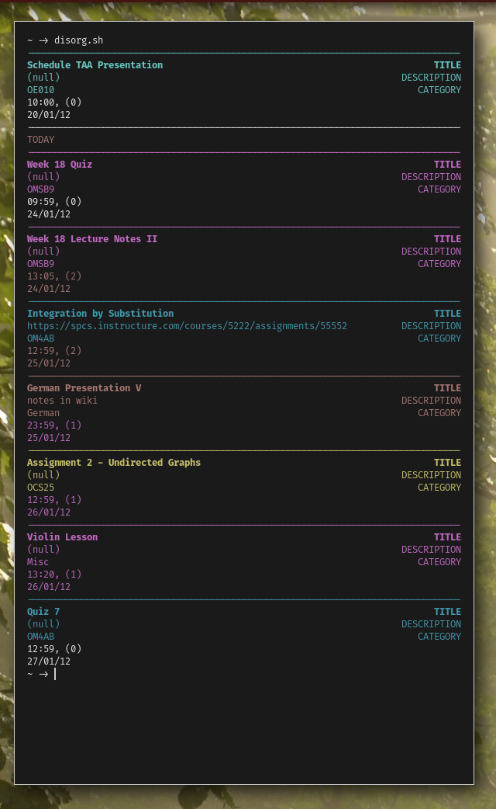

<h1 align="center">disorg</h1>
<p align="center">disorganized program inpsired by emacs' org-mode<br/>a tool to maintain a schedule and agenda over a directory of plain-text files</p>

<p align="center"></p>

## Usage
The base directory (by default `~/.disorg`, configurable via the `BASE_DIRECTORY` variable) contains a set of plain text files, events and wikis. Event files contain titles, descriptions, miscellaneous text, as well as a date and time at which they occur. Calling the script `disorg.sh` without any arguments aggregates all of these events into a sorted agenda. Wikis are similar, but they have no dates or times associated. Calling `disorg.sh -W` aggregates all of the wikis in the base directory to an alphabetically sorted list.

Events and wikis can contain miscellaneous text, anything that should be associated with the information (meeting links, page numbers, etc). To access this information, specify the title of the item after `-T`, i.e., `disorg.sh -W -T "Writing Assignment 5".

Categories are given by the parent directory of an event. For instance, `~/.disorg/Calculus/Homework 7.ev` would specify an event (probably called Homework 7) with the category Calculus, however `~/.disorg/Calculus/Homeworks/7.ev` has the category of Homeworks. In general, a verbose file hirearchy in this context is not a good thing. In the agenda view, categories are displayed with one of the 16 basic terminal colors, derived by hashing the title to an ANSI color code. To view only events or wikis of a certain category, specify the `-C` flag, i.e., `disorg.sh -C "OMSB9".

Events may have priorities, which affect the color of due dates in the agenda view.

## File Formats

Titles are specified as
```
!TITLE A title
```
Descriptions are specified as
```
!DESCRIPTION A description
```
Dates (by default in format D-M-Y but configurable via the `DATE_FORMAT` option) are specifed as
```
!DATE 1-1-21
```
Times are specified as
```
!TIME 00:00
```
Priorities as:
```
!PRIORITY LOW/MED/HIGH
```
Miscellaneous text requires no special formatting.

## Configuration
Configuration is done through a shell script, located at `~/.config/disorg/disorg`. The wrapper script around the binary sets default values for the configuration options, source the config file, and then export the values, to be loaded by `getenv()` in the binary.

Current config options are:
```bash
BASE_DIRECTORY="$HOME/.disorg" # where disorg looks for event/wiki files
DATE_FORMAT="D-M-Y"            # delimiter is also specified here (`D-M-Y`/`D/M/Y`)
TIME_FORMAT="H:M"
FOUR_DIGIT_YEAR="TRUE"         # 2021 vs 21
TODAY_COLOR='91'               # the ANSI escape code color used to mark the current time/today
PHIGH_COLOR='31'               # The ANSI escape code color used to mark high-priority events
PMED_COLOR='35'                # The ANSI escape code color used to mark medium-priority events
PLOW_COLOR='0'                 # The ANSI escape color code used ot mark low-priority events.
                               # By default this is just the reset code to remove any color.
DEBUG="FALSE"                  # run with valgrind to check for memory leaks
```

By default: dates are separated by dashes and in day-month-year format. Times are expected to be in 24-hour form.

## Building/Installing
`make && sudo make install`

## TODOs
* ✨ make software good ✨
